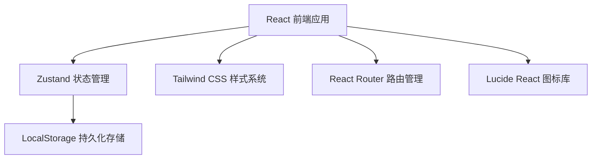
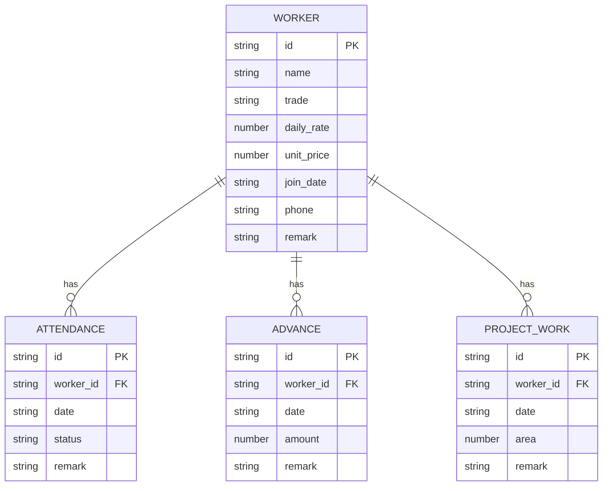

## 1. 架构设计



纯前端应用，数据存储在浏览器 LocalStorage 中，无需后端服务。

## 2. 技术选型说明

- **前端**：React@18 + TypeScript@5 + Vite@5
- **初始化工具**：vite-init (react-ts 模板)
- **样式**：Tailwind CSS@3
- **状态管理**：Zustand
- **路由**：React Router DOM@6
- **图标**：Lucide React
- **数据存储**：浏览器 LocalStorage
- **后端**：无（纯前端单页应用）
- **数据库**：无（使用 LocalStorage 模拟）

## 3. 路由定义

| 路由 | 用途 |
|-------|---------|
| / | 仪表盘首页 - 数据概览和快捷入口 |
| /workers | 工人管理 - 工人信息增删改查 |
| /attendance | 考勤打卡 - 批量点卯和考勤记录 |
| /salary | 工资结算 - 月度工资计算和明细 |
| /advances | 借支管理 - 借支登记和历史查询 |

## 4. 数据模型

### 4.1 实体关系图



### 4.2 数据定义

**工种枚举 (Trade)**
- `carpenter` - 木工
- `mason` - 瓦工
- `plumber_electrician` - 水电工
- `painter` - 油漆工

**考勤状态枚举 (AttendanceStatus)**
- `present` - 出勤
- `leave` - 请假
- `absent` - 旷工

**工人 (Worker)**
```typescript
interface Worker {
  id: string;
  name: string;
  trade: Trade;
  dailyRate: number;      // 日薪(元/天)
  unitPrice: number;      // 包活单价(元/平米)
  joinDate: string;       // 入职日期 YYYY-MM-DD
  phone?: string;
  remark?: string;
  createdAt: string;
}
```

**考勤记录 (Attendance)**
```typescript
interface Attendance {
  id: string;
  workerId: string;
  date: string;           // YYYY-MM-DD
  status: AttendanceStatus;
  remark?: string;
  createdAt: string;
}
```

**借支记录 (Advance)**
```typescript
interface Advance {
  id: string;
  workerId: string;
  date: string;           // YYYY-MM-DD
  amount: number;         // 借支金额
  remark?: string;
  createdAt: string;
}
```

**包活工作量 (ProjectWork)**
```typescript
interface ProjectWork {
  id: string;
  workerId: string;
  date: string;           // YYYY-MM-DD
  area: number;           // 完成面积(平米)
  remark?: string;
  createdAt: string;
}
```

## 5. 工资计算逻辑

### 5.1 计算公式

```
应发工资 = 点工工资 + 包活工资
  - 点工工资 = 出勤天数 × 日薪单价
  - 包活工资 = Σ(完成面积 × 包活单价)

实发工资 = 应发工资 - 借支总额
```

### 5.2 统计维度

- 按月统计：筛选指定年月的所有数据
- 按工人汇总：每个工人单独计算
- 按工种汇总：同工种合计

## 6. 项目结构

```
src/
├── components/          # 可复用组件
│   ├── Layout/          # 布局组件
│   ├── WorkerCard/      # 工人卡片
│   ├── AttendanceGrid/  # 考勤点卯网格
│   ├── SalaryTable/     # 工资表格
│   └── Modal/           # 弹窗组件
├── pages/               # 页面组件
│   ├── Dashboard.tsx
│   ├── Workers.tsx
│   ├── Attendance.tsx
│   ├── Salary.tsx
│   └── Advances.tsx
├── store/               # Zustand 状态管理
│   └── useStore.ts
├── types/               # TypeScript 类型定义
│   └── index.ts
├── utils/               # 工具函数
│   ├── date.ts          # 日期处理
│   ├── export.ts        # CSV导出
│   └── salary.ts        # 工资计算
├── App.tsx
├── main.tsx
└── index.css
```

## 7. 状态管理设计

Zustand Store 包含以下状态和方法：

```typescript
interface AppState {
  workers: Worker[];
  attendances: Attendance[];
  advances: Advance[];
  projectWorks: ProjectWork[];
  
  // Worker CRUD
  addWorker: (data: Omit<Worker, 'id' | 'createdAt'>) => void;
  updateWorker: (id: string, data: Partial<Worker>) => void;
  deleteWorker: (id: string) => void;
  
  // Attendance
  markAttendance: (workerId: string, date: string, status: AttendanceStatus) => void;
  batchMarkAttendance: (records: { workerId: string; date: string; status: AttendanceStatus }[]) => void;
  getAttendanceByDate: (date: string) => Attendance[];
  
  // Advance
  addAdvance: (data: Omit<Advance, 'id' | 'createdAt'>) => void;
  deleteAdvance: (id: string) => void;
  
  // ProjectWork
  addProjectWork: (data: Omit<ProjectWork, 'id' | 'createdAt'>) => void;
  
  // Salary
  calculateSalary: (workerId: string, yearMonth: string) => SalaryDetail;
  
  // Persistence
  loadFromStorage: () => void;
  saveToStorage: () => void;
}
```
